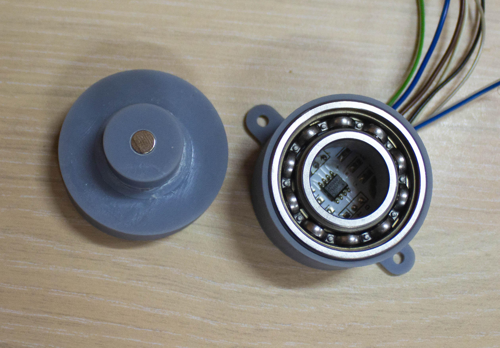
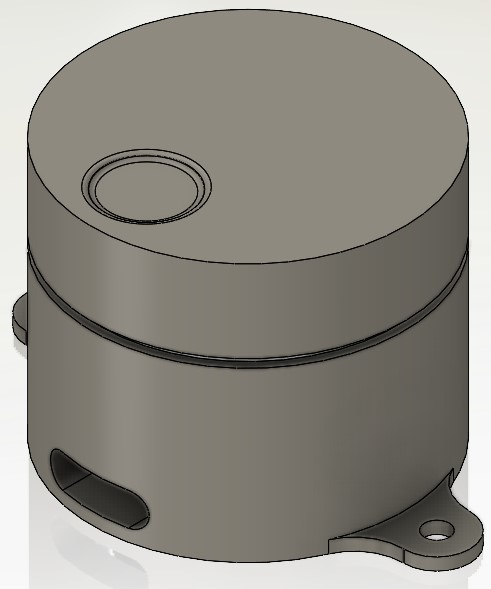
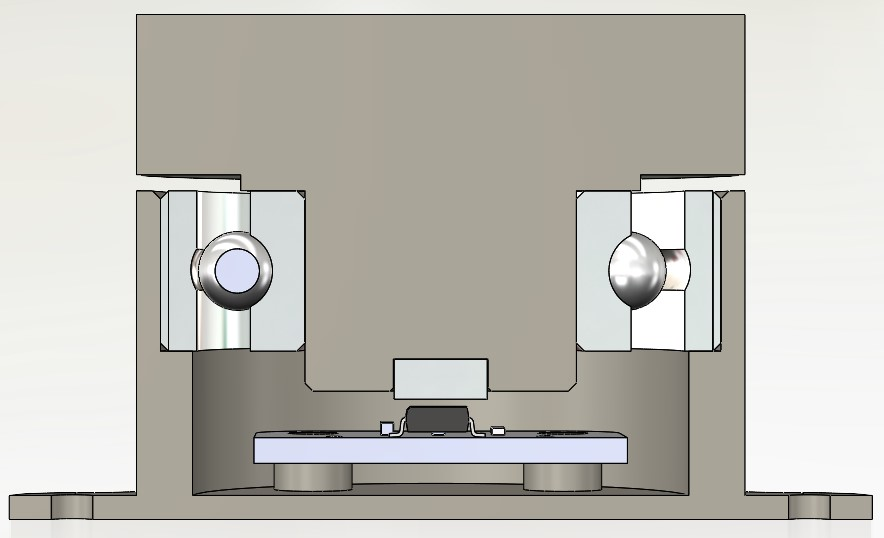

# Sample_Case_AS5600
* Проект простого корпуса для проверки и испытания модуля на базе "AS5600 12 bit Magnetic Rotary Position Sensor"
* Библиотека для магнитного энкодера [AS5600](https://github.com/S-LABc/AMS-AS5600-Arduino-Library)

## Описание
- Модели спроектированы в SolidWorks 2021 SP5.1
- Детали печатались на 3D принтере

## Что нужно
- Подшипник: **НСН 6003-2RS** 35х17х10мм. Удалены защитные крышки (был закрытого типа, стал открытого) и смазка, для снижения трения
- Магнит: дисковый диаметром **6х2.5мм**, **диаметрального намагничивания**, с достаточной силой магнитого поля
- Модуль: датчик AS5600 с AliEpress
- 2(4) винта: крепят модуль к основанию (можно приклеить парой капель цианоакрилата, он же секундный суперклей)
- 3D принтер

## Ссылки
[Оригинальный модуль](https://wiki.seeedstudio.com/Grove-12-bit-Magnetic-Rotary-Position-Sensor-AS5600/)
[Лист данных AS5600](https://ams.com/documents/20143/36005/AS5600_DS000365_5-00.pdf)
[Сайт производителя](https://ams.com/en/as5600)
- сторонние 3D модели
[Конденсатор](https://grabcad.com/library/ceramic-capacitors-smd-1)
[Резисторы](https://grabcad.com/library/high-precision-0603-1608-series-chip-resistor-3d-model-1/details?folder_id=9179287)
[Микросхема](https://grabcad.com/library/soic-narrow-smd-package-8-10-12-14-16-1)
[Подшипник](https://grabcad.com/library/bearing-ss-6003-2rs-double-sealed-ball-bearing-10-x-17-x-35mm)

## Изображения

